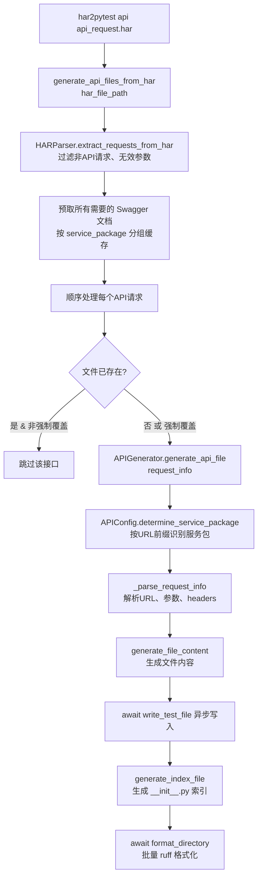
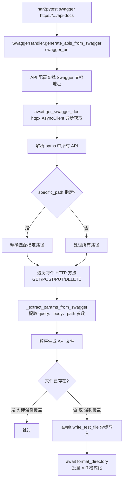

# API 文件生成两种方式详解

## 概述

`har2pytest` 提供两种方式生成 API 文件，每种方式适用于不同的场景：

| 方式 | 命令 | 输入源 | 适用场景 | 依赖 |
|------|------|--------|---------|------|
| **HAR 文件生成** | `har2pytest api` | `.har` 抓包文件 | 已有抓包数据，需要快速生成项目已有的 API 定义 | HAR 文件 + 网络配置 |
| **Swagger 文档生成** | `har2pytest swagger` | Swagger JSON URL | 后端提供了 Swagger 文档，需要生成完整的 API 定义 | Swagger 文档 URL |

---

## 方式一：从 HAR 文件生成 API 文件

### 用途

通过解析浏览器或工具抓取的 HAR（HTTP Archive）文件，自动提取其中的 API 请求信息，生成项目的 Python API 接口文件。

### 调用链



### 详细步骤

#### Step 1: `generate_api_files_from_har()`（异步，顺序处理）

```
输入: har_file_path
 └─ 校验 HAR 文件存在
 └─ HARParser.extract_requests_from_har() → 提取 API 请求列表
 │     过滤规则:
 │     - 移除非 API 请求（CSS、JS、图片等）
 │     - 过滤无效参数（rnd、timestamp 等，由 APIConfig.INVALID_PARAMS 定义）
 │     - 布尔值自动转换（"true"/"false" 字符串 → Python 布尔值）
 │     - 可选去重（filter_duplicate_url=True 时合并重复 URL）
 │
 └─ 预取 Swagger 文档:
 │     按 service_package 分组，预先获取所有需要的 Swagger 文档
 │     避免后续每个请求各自并发获取导致竞态条件
 │
 └─ 异步并行处理（asyncio.as_completed）:
 │     每个 API 请求并发执行 generate_api_file()
 │     Swagger 文档通过 swagger_doc 参数传入，避免共享状态竞态条件
 │     文件写入通过 await write_test_file() 异步执行
 │
 └─ 所有请求处理完毕后 → await format_directory(output_dir) 一次性 ruff 格式化
```

> **并行处理说明**：所有 API 请求通过 `asyncio.as_completed` 并行处理，Swagger 文档在处理前预取缓存，通过 `swagger_doc` 参数传入各任务，避免 `url_matcher.swagger_data` 共享状态导致的竞态条件。生成完毕后对整个输出目录进行一次性 ruff 格式化。

#### Step 2: `check_api_exists()`

```
输入: url, service_package
 └─ 通过 URLMatcher.generate_function_name() 生成函数名
 └─ 检查根目录及服务包目录下是否已存在同名文件
 └─ 返回 True/False
```

#### Step 3: `determine_service_package()`

根据 URL 前缀自动识别服务包，决定文件存放目录：

| URL 前缀 | 服务包目录 |
|---------|-----------|
| `/mobile/...` | `mobile_application` |
| `/invt/...` | `inventory_application` |

##### Step 4: `_parse_request_info()`

解析请求信息的核心步骤：

```
输入: request_info（method, url, query_params, post_data, headers）
 └─ 处理 headers：
 │     - 保留 APIConfig.HEADERS_TO_INCLUDE 中定义的字段
 │     - 补充 APIConfig.REQUIRED_HEADERS 中的默认字段
 │
 └─ 检测上传类型：
 │     - content-type 含 "multipart/form-data" → is_file_upload = True
 │     - content-length=0 且无 post_data → is_need_urlencode = True
 │
 └─ URL 匹配：
       - URLMatcher 识别路径参数模式（如 /user/{id}/detail）
       - 提取 path_params（如 {"id": "123"}）
       - 生成 URL 模板（如 /user/{params['id']}/detail）
```

#### Step 5: `generate_file_content()`

生成 API 文件的完整内容，包含以下部分：

```
├── imports 部分
│   ├── import os
│   ├── from util.client import client
│   └── 文件上传时额外导入:
│       └── from requests_toolbelt import MultipartEncoder
│
├── params 参数定义（如有参数）
│   ├── params = { ... }    # GET 请求的查询参数
│   ├── data = { ... }      # POST 请求的 body 参数
│   └── files = { ... }     # 文件上传参数
│   每个参数带注释: key: value,  # 参数说明
│
├── headers 定义
│   └── headers = { "authorization": f"bearer {os.environ['access_token']}", ... }
│
└── 函数定义
    ├── def function_name(params=params, headers=headers):
    │       接口描述 / URL 路径
    │       参数说明（来自 Swagger 文档，如有）
    │
    ├── url = "/api/example"
    │   路径参数时: url = f"/user/{params['id']}/detail"
    │
    └── 请求调用:
        ├── GET:  client.get(url=url, params=params, headers=headers)
        ├── POST: client.post(url=url, json=data, headers=headers)
        ├── 文件上传: MultipartEncoder + client.post(url=url, data=m, headers=headers)
        └── URL编码: client.post(url=url, data=urllib.parse.urlencode(data), headers=headers)
```

### 生成示例

#### 示例 1：GET 请求（列表查询）
```python
import os

from util.client import client

params = {
    "keyword": "",              # 关键字搜索
    "pageNum": 0,               # 页数
    "pageSize": 0,              # 页大小
}

headers = {
    "authorization": f"bearer {os.environ['access_token']}",
    "content-length": "0",
}


def _mobile_order_list(params=params, headers=headers):
    """
    订单分页查询
    /mobile/order/list

    参数说明:
    - keyword: 关键字搜索
    - pageNum: 页数
    - pageSize: 页大小
    """

    url = "/mobile/order/list"
    with client.get(url=url, params=params, headers=headers) as r:
        return r
```

#### 示例 2：POST 请求（带 data）
```python
import os

from util.client import client

data = {
    "orderNo": "",           # 订单号
    "customerPhone": "",     # 客户手机号
    "pageNum": 0,            # 页数
    "pageSize": 0,           # 页大小
}

headers = {
    "authorization": f"bearer {os.environ['access_token']}",
    "content-type": "application/json",
}


def _order_export_handledDetail(data=data, headers=headers):
    """
    明细导出
    /order/export/handledDetail
    """

    url = "/order/export/handledDetail"
    with client.post(url=url, json=data, headers=headers) as r:
        return r
```

#### 示例 3：路径参数接口
```python
import os

from util.client import client

params = {
    "id": "123",
}

headers = {
    "authorization": f"bearer {os.environ['access_token']}",
}


def _mobile_order_id(params=params, headers=headers):
    """
    订单详情
    /mobile/order/{id}
    """

    url = f"/mobile/order/{params['id']}"
    with client.get(url=url, params=params, headers=headers) as r:
        return r
```

---

## 方式二：从 Swagger 文档生成 API 文件

### 用途

直接从后端的 Swagger/OpenAPI 文档中读取接口定义，自动生成项目的 API 文件。这种方式生成的参数类型更准确，且自带接口描述和参数说明。

### 调用链



### 详细步骤

#### Step 1: `generate_apis_from_swagger()`

```
输入: swagger_url, force_overwrite=False, specific_path=None
 └─ await get_swagger_doc() → 异步获取 Swagger 文档数据（含缓存）
 │     httpx.AsyncClient 发送 HTTP 请求
 │
 └─ 设置 url_matcher.swagger_data:
 │     将 Swagger 文档数据设置到 url_matcher，确保路径参数提取正确
 │
 └─ 解析 basePath + paths:
 │     basePath: /api
 │     paths:
 │       /user/list: { get: { ... } }
 │       /user/{id}: { get: { ... }, put: { ... } }
 │
 └─ 如果指定了 specific_path，只处理匹配的路径
 │     （自动处理 basePath 前缀）
 │
 └─ 顺序处理:
 │     每个 path + method 组合依次执行:
 │       _extract_params_from_swagger() → 提取参数
 │       generate_api_file() → 生成文件内容
 │       await write_test_file() → 异步写入
 │
 └─ 所有文件生成完毕后 → await format_directory(output_dir) 一次性 ruff 格式化
```

> **顺序处理说明**：Swagger 文档获取使用 `httpx.AsyncClient` 异步 HTTP 请求；多个 API 文件按顺序生成，避免并行时 `url_matcher.swagger_data` 共享状态导致的竞态条件。swagger_data 在处理前统一设置到 url_matcher。文件写入异步执行。生成完毕后对整个输出目录进行一次性 ruff 格式化。

#### Step 2: `_extract_params_from_swagger()`

从 Swagger 文档中提取参数，分类处理：

```
输入: parameters 数组, swagger_data
 │
 ├── in: query → query_params（查询参数）
 │   例: { name: "pageNum", type: "integer" } → pageNum: 0
 │
 ├── in: path → path_params（路径参数）
 │   例: { name: "id", type: "string" } → id: ""
 │
 ├── in: body / $ref → post_data（body 参数）
 │   例: { name: "order", schema: { $ref: "#/definitions/Order" } }
 │   → 递归解析 $ref → 展开为完整数据结构
 │
 └── 所有参数添加默认值:
       string → ""
       integer → 0
       number → 0.0
       boolean → False
       array → []
```

#### Step 3: 生成 API 文件

Swagger 方式额外传入 `swagger_info` 参数，HAR 方式在 `generate_api_file()` 内部也会自动查询 Swagger 填充元信息，最终效果一致：

- 接口描述（summary）自动填充
- 参数说明（description）自动填充到注释中
- 函数注释中包含完整的参数说明列表

### 生成示例

```python
import os

from util.client import client

params = {
    "pageNum": 0,            # 页码
    "pageSize": 0,           # 每页数量
    "keyword": "",           # 关键字
}

headers = {
    "authorization": f"bearer {os.environ['access_token']}",
    "content-length": "0",
}


def _mgmt_user_list(params=params, headers=headers):
    """
    用户列表查询
    /mgmt/user/list

    参数说明:
    - pageNum: 页码
    - pageSize: 每页数量
    - keyword: 关键字
    """

    url = "/mgmt/user/list"
    with client.get(url=url, params=params, headers=headers) as r:
        return r
```

---

## 两种方式对比

| 维度 | HAR 文件生成 | Swagger 文档生成 |
|------|-------------|-----------------|
| **数据来源** | 浏览器/工具抓包的 `.har` 文件 | 后端提供的 Swagger JSON 文档 |
| **参数值** | 实际请求中的真实值 | 类型的默认值（0、""、False） |
| **接口描述** | 自动填充 summary | 自动填充 summary |
| **参数说明** | 自动填充 description | 自动填充 description |
| **请求类型覆盖** | 只包含抓包中实际出现的接口 | 文档中定义的所有接口 |
| **路径参数** | 通过 URL 模式匹配识别 | 通过 in: path 精确识别 |
| **文件上传** | 自动检测 multipart/form-data | 通过参数类型检测 |
| **建议使用场景** | 已有抓包数据快速生成 | 后端文档完备时批量生成 |

---

## 常用命令

### 从 HAR 文件生成

```bash
# 基本用法（默认使用当前目录的 api_request.har，输出到 api/）
har2pytest api

# 指定 HAR 文件和输出目录
har2pytest api api_request.har --output apis

# 强制覆盖已存在的文件
har2pytest api api_request.har --output apis --overwrite
```

### 从 Swagger 文档生成

```bash
# 基本用法
har2pytest swagger https://taobao.com/sw/order-application/v2/api-docs

# 指定输出目录
har2pytest swagger https://taobao.com/sw/order-application/v2/api-docs --output apis

# 强制覆盖已存在的文件
har2pytest swagger https://taobao.com/sw/order-application/v2/api-docs --overwrite

# 只生成指定路径的 API 文件
har2pytest swagger https://taobao.com/sw/order-application/v2/api-docs --path /mgmt/user/list

# 组合使用
har2pytest swagger https://taobao.com/sw/order-application/v2/api-docs --output apis --overwrite --path /mgmt/user/list
```

---

## 最佳实践

### 推荐流程

```bash
# 1. 从 Swagger 文档生成 API 文件（获得完整的接口列表和参数说明）
har2pytest swagger https://taobao.com/sw/order-application/v2/api-docs --output apis

# 2. 从 HAR 文件补充缺失的接口（覆盖 Swagger 中未定义的接口）
har2pytest api api_request.har --output apis

# 3. 生成测试用例
har2pytest testcase list_query test_4291 api_request.har
```

### 注意事项

1. **优先使用 Swagger 文档生成**：参数类型准确、自带描述说明
2. **HAR 文件补充**：对于 Swagger 文档中未覆盖的接口，通过 HAR 文件生成然后手动补充参数说明
3. **路径参数处理**：路径参数接口会自动生成 `f-string` 格式的 URL，无需手动替换
4. **Swagger 文档缓存**：获取到的 Swagger 文档会缓存，避免重复请求