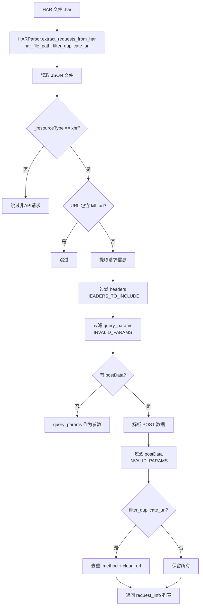

# HAR 文件解析详解

## 概述

HAR（HTTP Archive）文件是浏览器或抓包工具导出的网络请求记录文件，格式为 JSON。`har2pytest` 通过解析 HAR 文件提取 API 请求信息，用于生成 API 文件或测试用例。

---

## 解析流程

### 调用链



### 详细步骤

#### Step 1: 读取 HAR 文件

```
输入: har_file_path
 └─ 以 UTF-8 编码读取 JSON 文件
 └─ 定位到 log.entries 数组
 └─ entries 为空 → 返回空列表
 └─ JSON 格式错误 / 文件不存在 → 返回空列表
```

#### Step 2: 过滤非 API 请求

仅保留 `_resourceType === "xhr"` 的条目，过滤掉以下资源类型的请求：

| 资源类型 | 处理方式 |
|---------|---------|
| `xhr` | **保留** - API 请求 |
| `document` | 跳过 - HTML 文档 |
| `stylesheet` | 跳过 - CSS 样式 |
| `script` | 跳过 - JS 脚本 |
| `image` | 跳过 - 图片 |
| `font` | 跳过 - 字体 |
| `media` | 跳过 - 媒体 |
| `websocket` | 跳过 - WebSocket |
| `other` | 跳过 - 其他 |

#### Step 3: 过滤无效 URL

检查 URL 是否包含 `KILL_URLS` 中的关键字：

```python
KILL_URLS = [
    ".js",
    ".css",
    ".png",
    ".jpg",
    ".gif",
    ".ico",
    ".svg",
    ".woff",
    ".woff2",
    ".ttf",
    ".eot",
]
```

只要 URL 中任意位置包含以上关键字，即跳过该请求。

#### Step 4: 过滤 Headers

仅保留配置 `HEADERS_TO_INCLUDE` 中定义的 headers 和以下必要的 headers：

| Header | 说明 |
|--------|------|
| `content-type` | 必须保留，标识请求体格式 |
| `content-length` | 必须保留，标识请求体长度 |
| `origin` | 必须保留，用于 URL 规范化回退 |
| `authorization` | 认证信息（来自配置） |
| `channel` | 渠道标识（来自配置） |
| `...` | 其他配置中定义需保留的 headers |

#### Step 5: 过滤无效参数

使用 `INVALID_PARAMS` 配置过滤掉以下参数：

```python
INVALID_PARAMS = ["rnd", "timestamp", "_", "t", "callback", "jsonp"]
```

这些参数通常是前端框架或工具自动添加的，对 API 测试无实际意义。

#### Step 6: 解析 POST 数据

根据 `content-type` 决定解析方式：

| Content-Type | 解析方式 | 示例 |
|-------------|---------|------|
| `application/json` | `json.loads(postData.text)` | `{"pageNum": 1, "pageSize": 10}` |
| `multipart/form-data` | 遍历 `postData.params` | `{"file": "...", "name": "..."}` |
| `application/x-www-form-urlencoded` | **不支持** → 抛出异常 | - |

#### Step 7: 提取 URL 相对路径

使用 `base_urls` 配置从完整 URL 中提取相对路径：

```python
BASE_URLS = [
    "https://api.example.com",
    "https://api.example.cn",
]

# 提取过程
# 完整 URL: https://api.example.com/appStore/mobile/order/page?pageNum=1
# 提取后  : /appStore/mobile/order/page
```

当未配置 `base_urls` 时，回退使用 `origin` header 进行提取。

#### Step 8: 去重（可选）

当 `filter_duplicate_url=True` 时，对 `method + clean_url` 进行去重，保留第一个出现的请求。

#### Step 9: 构建请求信息

每个请求最终生成如下结构：

```python
request_info = {
    "method": "GET",              # HTTP 方法
    "url": "/api/example",        # 清理后的相对 URL
    "full_url": "https://...",    # 完整 URL
    "headers": { ... },           # 过滤后的 headers
    "content_type": "...",        # 内容类型
    "cookies": { ... },           # Cookie
    "query_params": { ... },      # 过滤后的查询参数
    "post_data": { ... },         # 解析后的 POST 数据
    "response_status": 200,       # 响应状态码
    "response_content": { ... },  # 响应内容（JSON 解析后）
    "response_time": 123.45,      # 响应时间（毫秒）
    "server_ip": "192.168.1.1",   # 服务器 IP
}
```

---

## HAR 文件结构说明

HAR 文件的 JSON 结构如下所示：

```json
{
    "log": {
        "version": "1.2",
        "creator": { "name": "Chrome", "version": "91.0.4472.124" },
        "entries": [
            {
                "_resourceType": "xhr",          // 资源类型，用于过滤
                "request": {
                    "method": "GET",
                    "url": "https://api.example.com/appStore/mobile/order/page?pageNum=1&pageSize=10",
                    "headers": [
                        { "name": "authorization", "value": "bearer xxx" },
                        { "name": "content-type", "value": "application/json" }
                    ],
                    "queryString": [
                        { "name": "pageNum", "value": "1" },
                        { "name": "pageSize", "value": "10" }
                    ],
                    "postData": {
                        "mimeType": "application/json",
                        "text": "{\"keyword\": \"test\"}"
                    },
                    "cookies": []
                },
                "response": {
                    "status": 200,
                    "content": {
                        "text": "{\"code\": 200, \"data\": []}"
                    }
                },
                "time": 123.45,
                "serverIPAddress": "192.168.1.1"
            }
        ]
    }
}
```

---

## URL 路径参数识别

### 方式 1：通过 Swagger 文档匹配

```
完整 URL: /mobile/returnOrder/12345

Swagger 路径: /mobile/returnOrder/{id}

匹配结果: { "id": "12345" }
URL 模板: /mobile/returnOrder/{params['id']}
```

流程：
1. 获取服务对应的 Swagger 文档数据
2. 将请求 URL 与 Swagger 中所有 paths 逐一匹配
3. 成功匹配 → 提取路径参数 → 生成 `f-string` 格式 URL 模板
4. 匹配失败 → 回退到方式 2

### 方式 2：通过配置中的 PATH_URLS 匹配

```python
PATH_URLS = [
    "/mobile/returnOrder/{id}",
    "/mgmt/order/{orderId}/detail",
    "/appStore/product/{productId}/sku/{skuId}",
]
```

将请求 URL 逐个与配置中的模板模式进行匹配，成功则提取路径参数。

### 方式 3：数字路径段启发式识别

当以上两种方式都未匹配到路径参数时，通过正则检查 URL 中是否包含数字路径段（如 `/order/123/detail`），如果存在则作为路径参数候选进行处理。

---

## 辅助功能

### `print_api_summary()`

打印 HAR 文件中所有 API 请求的摘要信息，包含：

```
HAR文件: api_request.har
共发现 15 个API请求
--------------------------------------------------------------------------------
 1. GET     200   123.45ms /appStore/mobile/order/page
 2. POST    200   456.78ms /mgmt/dataAdmin/export/handledDetail
 3. GET     500    12.34ms /mobile/returnOrder/12345
...
--------------------------------------------------------------------------------
统计: 成功 13 个, 失败 2 个, 平均响应时间 234.56ms
```

---

## 配置项

| 配置项 | 用途 | 示例值 |
|--------|------|--------|
| `BASE_URLS` | 从完整 URL 提取相对路径 | `["https://api.example.com"]` |
| `KILL_URLS` | 过滤不需要的 URL | `[".js", ".css", ".png"]` |
| `INVALID_PARAMS` | 过滤无用参数 | `["rnd", "timestamp", "_"]` |
| `HEADERS_TO_INCLUDE` | 保留的 headers | `{"authorization": "...", "channel": "pc"}` |
| `REQUIRED_HEADERS` | 必要的 headers | `{"authorization": "..."}` |
| `PATH_URLS` | URL 模板配置 | `["/order/{id}/detail"]` |