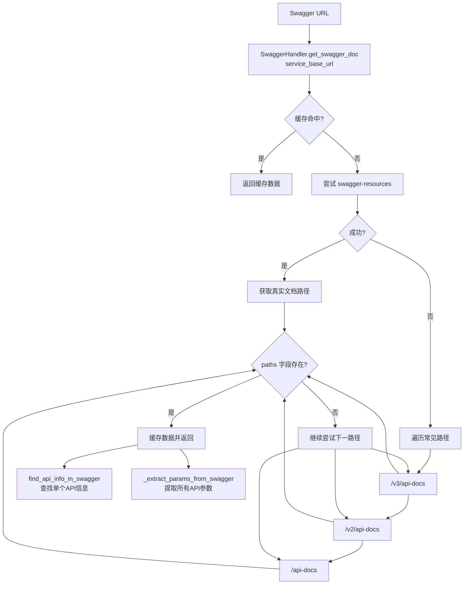
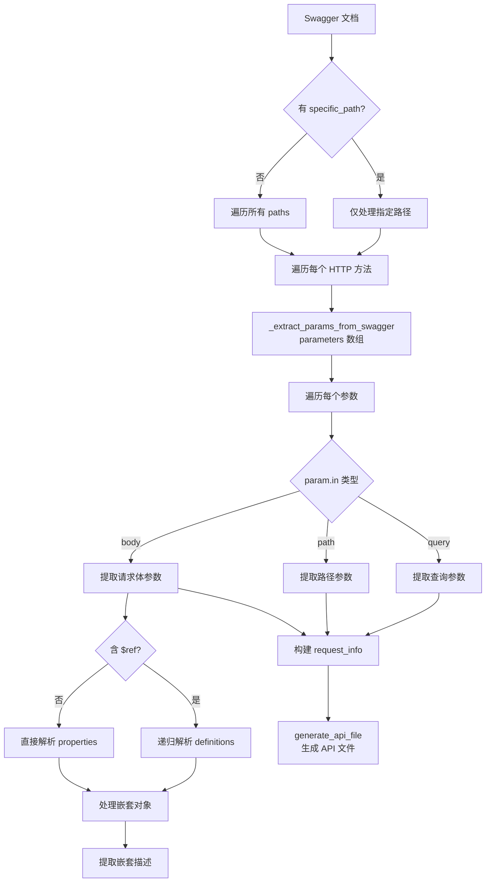

# Swagger 文档解析详解

## 概述

Swagger/OpenAPI 文档是后端服务提供的 RESTful API 接口定义文档，格式为 JSON。`har2pytest` 通过解析 Swagger 文档获取 API 路径、参数类型、接口描述等信息，用于生成 API 定义文件。

---

## 获取流程

### 调用链



### Step 1: 获取 Swagger 文档

提供两种获取策略，优先使用 `swagger-resources`，失败后回退到常见路径。

#### 策略 1：通过 `swagger-resources` 发现（推荐）

```
请求: GET https://taobao.com/sw/order-application/v2/api-docs/swagger-resources

响应:
[
    {
        "name": "order-application",
        "location": "/sw/order-application/v2/api-docs",
        "url": "/sw/order-application/v2/api-docs"
    }
]

→ 提取 location/url 字段
→ 请求完整文档: GET https://taobao.com/sw/order-application/v2/api-docs
→ 返回 Swagger JSON 数据
```

#### 策略 2：遍历常见路径（回退）

按以下顺序依次尝试，直到获取到包含 `paths` 字段的有效文档：

```python
doc_paths = [
    "/v3/api-docs",     # OpenAPI 3.0
    "/v2/api-docs",     # Swagger 2.0
    "/api-docs",        # 兼容路径
]
```

### Step 2: 缓存机制

获取到的 Swagger 文档会缓存在内存中，避免重复请求：

```python
# 缓存 key: service_base_url
self.swagger_cache = {
    "https://taobao.com/sw/order-application/v2/api-docs": { ... },
}
```

---

## 参数提取流程

### 调用链



### Step 1: 解析参数类型

根据 Swagger 参数定义的 `in` 字段分类处理：

| in 值 | 参数类型 | 存储位置 | 生成示例 |
|-------|---------|---------|---------|
| `query` | 查询参数 | `query_params` | `pageNum: 0, pageSize: 0` |
| `path` | 路径参数 | `path_params` | `id: ""` → URL 模板 `{params['id']}` |
| `body` | 请求体 | `post_data` | `{"keyword": "", "pageNum": 0}` |

### Step 2: 参数默认值映射

根据参数类型自动生成默认值：

```python
类型映射:
    string  → ""
    integer → 0
    int     → 0
    number  → 0.0
    float   → 0.0
    boolean → False
    array   → []
    object  → {}
```

### Step 3: 解析 body 参数（嵌套模型）

当 body 参数包含 `$ref` 引用时，递归解析 `definitions` 中的模型定义：

```json
// Swagger 文档定义
{
    "paths": {
        "/mgmt/order/list": {
            "post": {
                "parameters": [
                    {
                        "name": "body",
                        "in": "body",
                        "schema": {
                            "$ref": "#/definitions/OrderQuery"
                        }
                    }
                ]
            }
        }
    },
    "definitions": {
        "OrderQuery": {
            "properties": {
                "keyword": { "type": "string", "description": "关键字" },
                "pageNum": { "type": "integer", "description": "页码" },
                "pageSize": { "type": "integer", "description": "每页数量" },
                "statusList": {
                    "type": "array",
                    "items": {
                        "type": "integer"
                    },
                    "description": "状态列表"
                }
            }
        }
    }
}
```

解析结果：

```python
post_data = {
    "keyword": "",
    "pageNum": 0,
    "pageSize": 0,
    "statusList": [],
}
```

### Step 4: 嵌套对象处理

当模型属性中包含嵌套对象或数组时，递归处理：

```json
{
    "definitions": {
        "Order": {
            "properties": {
                "receiver": {
                    "type": "object",
                    "properties": {
                        "name": { "type": "string" },
                        "phone": { "type": "string" },
                        "address": {
                            "$ref": "#/definitions/Address"
                        }
                    }
                },
                "items": {
                    "type": "array",
                    "items": {
                        "$ref": "#/definitions/OrderItem"
                    }
                }
            }
        },
        "Address": {
            "properties": {
                "province": { "type": "string" },
                "city": { "type": "string" },
                "district": { "type": "string" }
            }
        },
        "OrderItem": {
            "properties": {
                "skuId": { "type": "string" },
                "quantity": { "type": "integer" }
            }
        }
    }
}
```

解析结果：

```python
post_data = {
    "receiver": {
        "name": "",
        "phone": "",
        "address": {
            "province": "",
            "city": "",
            "district": ""
        }
    },
    "items": [
        {
            "skuId": "",
            "quantity": 0
        }
    ]
}
```

### Step 5: 提取参数描述

同时提取参数的 `description` 字段，后续用于 API 文件中的参数说明注释：

```python
param_descriptions = {
    "keyword": "关键字",
    "pageNum": "页码",
    "pageSize": "每页数量",
    "receiver.name": "收货人姓名",     # 嵌套参数使用点号分隔
    "receiver.phone": "收货人电话",
    "items.skuId": "商品SKU ID",       # 数组内元素参数
}
```

---

## API 信息查找

### `find_api_info_in_swagger()`

在已获取的 Swagger 文档中查找单个 API 的详细信息：

```
输入: api_path="/mgmt/order/list", method="POST"

处理步骤:
1. 去除 basePath（如 /api）→ search_path = "/mgmt/order/list"
2. 在 paths 中精确匹配
3. 获取该路径下指定 method 的详细信息
4. 遍历 parameters 提取参数描述
5. 处理 body 参数的 $ref 引用，展开嵌套参数描述

输出:
{
    "summary": "订单列表查询",
    "description": "分页查询订单列表",
    "parameters": {
        "keyword": "关键字",
        "pageNum": "页码",
        "pageSize": "每页数量"
    }
}
```

---

## 生成 API 文件

### `generate_apis_from_swagger()`

从 Swagger 文档批量生成 API 文件：

```
输入: swagger_url, force_overwrite=False, specific_path=None

处理流程:
1. get_swagger_doc() → 获取 Swagger 文档
2. 遍历 paths（或只处理 specific_path）
3. 对每个 path + method 组合:
   a. _extract_params_from_swagger() → 提取参数
   b. 构建 request_info + swagger_info
   c. api_generator.generate_api_file() → 生成文件
4. 返回生成的文件路径列表
```

与 HAR 方式生成的文件区别：

| 维度 | HAR 生成 | Swagger 生成 |
|------|---------|-------------|
| **参数值** | 实际请求值 | 类型默认值 |
| **接口描述** | 自动填充 `summary` | 自动填充 `summary` |
| **参数说明** | 自动填充 `description` | 自动填充 `description` |
| **接口覆盖** | 仅抓包出现的接口 | 文档定义的所有接口 |

---

## 常用命令

```bash
# 从 Swagger 文档生成所有 API 文件
har2pytest swagger https://taobao.com/sw/order-application/v2/api-docs

# 指定输出目录
har2pytest swagger https://... --output apis

# 只生成指定路径
har2pytest swagger https://... --path /mgmt/order/list

# 强制覆盖已存在文件
har2pytest swagger https://... --overwrite

# 组合使用
har2pytest swagger https://... --output apis --overwrite --path /mobile/order/list
```

---

## 配置项

| 配置项 | 用途 | 说明 |
|--------|------|------|
| `SWAGGER_DOC_URLS` | Swagger 文档 URL 映射 | `{"服务名": "URL"}` 格式 |
| `REQUIRED_HEADERS` | 默认请求头 | 自动添加到所有生成的 API 文件 |