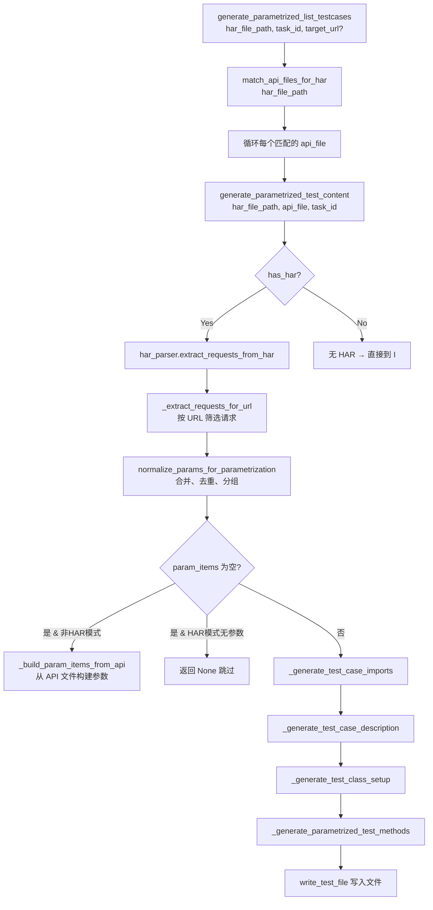
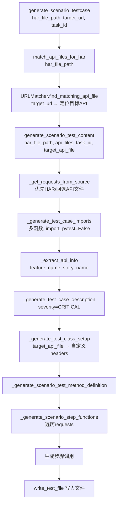

# 测试用例生成三种模式详解

## 概述

`TestCaseGenerator` 提供三种测试用例生成模式，每种模式适用于不同的测试场景：

| 模式 | 入口方法 | 参数来源 | 适用场景 |
|------|---------|---------|---------|
| **parametrized_list** | `generate_parametrized_list_testcases()` | HAR 文件 | 列表查询接口的 pytest 参数化测试 |
| **complex_scenario** | `generate_scenario_testcase()` | HAR 文件 | 多步骤业务流程的链路测试 |
| **batch** | `generate_batch_testcases()` | API 文件 | 批量从 API 定义文件直接生成测试用例 |

---

## 模式一：parametrized_list（列表查询参数化模式）

### 用途

为列表查询类接口生成 `@pytest.mark.parametrize` 参数化测试用例。每个参数独立为一个测试方法，覆盖该参数的不同取值。

### 调用链



### 详细步骤

#### Step 1: `generate_parametrized_list_testcases()`

```
输入: har_file_path, task_id, target_url?
 └─ 校验 HAR 文件存在
 └─ match_api_files_for_har() → 获取匹配的 API 文件列表
 └─ 遍历每个 api_file:
      ├─ 若有 target_url，跳过不匹配的 API
      ├─ 调用 generate_parametrized_test_content() 生成内容
      └─ write_test_file() 写入文件
```

#### Step 2: `match_api_files_for_har()`

```
输入: har_file_path
 └─ har_parser.extract_requests_from_har() 提取所有请求
 └─ 遍历请求，为每个 URL 准备 URLMatcher（绑定 Swagger 文档）
 └─ _get_all_api_files() 扫描 api_dir 获取所有 API 文件
 └─ URLMatcher.find_matching_api_file() 逐个 URL 匹配
 └─ 返回去重后的 API 文件路径列表
```

#### Step 3: `generate_parametrized_test_content()`

```
输入: har_file_path?, api_file, task_id
 └─ _get_api_file_info(api_file) → 获取 function_name, url, params, data, param_remarks
 └─ _extract_api_info(api_file) → feature_name, story_name
 └─ 合并 api_info["params"] 和 api_info["data"] 得到 api_params
 │
 ├─ [参数来源判断]
 │  ├─ has_har = har_file_path 存在且文件存在
 │  ├─ has_har=True:
 │  │    ├─ har_parser.extract_requests_from_har() 提取请求
 │  │    ├─ _extract_requests_for_url() 按 URL 过滤并合并参数
 │  │    └─ normalize_params_for_parametrization() 标准化
 │  └─ has_har=False:
 │       └─ _build_param_items_from_api(api_params, ...) 从 API 文件构建
 │
 ├─ 无参数 → 返回 None
 │
 └─ [生成代码]
      ├─ _generate_test_case_imports(单函数, import_pytest=True)
      ├─ _generate_test_case_description(severity="NORMAL")
      ├─ _generate_test_class_setup() → 默认 headers
      └─ _generate_parametrized_test_methods(param_items, ...)
```

#### Step 4: `_extract_requests_for_url()`

```
输入: requests, api_url
 └─ URLMatcher.normalize_url() 标准化 URL
 └─ 遍历请求，筛选 URL 匹配的请求
 └─ merge_request_params() 合并 query_params 和 post_data
 └─ 收集有效参数名到 all_params
 └─ 记录第一个匹配的请求方法
 └─ 返回 (all_params, all_requests_params, request_method)
```

#### Step 5: `normalize_params_for_parametrization()`

```
输入: requests_params, param_remarks?
 └─ 遍历每个请求的参数:
      ├─ 过滤分页参数
      ├─ 分离有效参数(other_params 为无效参数)
      ├─ 单参数 → 按参数名分组收集 values
      └─ 多参数(>1) → 按排序后的逗号连接名组合，以元组收集 values
 └─ 遍历分组结果:
      ├─ 状态参数 → _parse_state_values() 从备注解析状态枚举值
      └─ 普通参数 → deduplicate_values() 去重
 └─ 返回 [{param_name: values, other_params: {...}}, ...]
```

#### Step 6: `_generate_parametrized_test_methods()`

```
输入: param_items, api_description, function_name, request_method, param_remarks
 └─ 遍历 param_items:
      ├─ _generate_parametrize_decorator(param_name, values, is_combination)
      │    ├─ 单参数: @pytest.mark.parametrize("param", [v1, v2, ...])
      │    └─ 组合: @pytest.mark.parametrize("a,b", [(v1,v2), ...])
      ├─ _generate_test_method_definition(title, method_name, params)
      │    ├─ @allure.title("描述: 参数说明 查询")
      │    └─ def test_N_funcname(self, param):
      ├─ _generate_test_method_body(param_var_name, param_name, other_params)
      │    ├─ 构建 {param_name: param_value, other_key: other_value, ...}
      │    └─ data = {...} 或 params = {...}
      └─ _generate_test_method_assertions(function_name, param_var_name)
           └─ with function_name(params=params, headers=self.headers) as r:
              assert r.status_code == 200
              assert r.json()['code'] == 200
```

### 生成的测试用例示例

```python
import pytest
import allure
from allure_commons.types import Severity
from apis.mall_center import _list_page

@allure.severity(Severity.NORMAL)
@allure.feature('mall_center')
@allure.story('/api/mall/list')
class TestClass:

    def setup_class(self):
        self.headers = {
            "channel": "pc",
            "client": "op",
            "authorization": f"bearer {os.environ['access_token']}",
        }

    @pytest.mark.parametrize("status", [1, 2, 3])
    @allure.title("商品列表: status 查询")
    def test_0_list_page(self, status):
        params = {
            "status": status,
            "page": "1",
            "page_size": "20",
        }
        with _list_page(params=params, headers=self.headers) as r:
            assert r.status_code == 200
            assert r.json()['code'] == 200

    @pytest.mark.parametrize("category_id", ["1001", "1002"])
    @allure.title("商品列表: category_id 查询")
    def test_1_list_page(self, category_id):
        params = {
            "category_id": category_id,
            "page": "1",
            "page_size": "20",
        }
        with _list_page(params=params, headers=self.headers) as r:
            assert r.status_code == 200
            assert r.json()['code'] == 200
```

---

## 模式二：complex_scenario（复杂场景流程模式）

### 用途

为多步骤业务流程生成场景化链路测试用例。每个步骤对应一个 `@allure.step` 嵌套函数，测试数据在步骤间传递。

### 调用链



### 详细步骤

#### Step 1: `generate_scenario_testcase()`

```
输入: har_file_path, target_url, task_id
 └─ 校验 HAR 文件存在
 └─ match_api_files_for_har() → 获取所有匹配的 API 文件
 └─ URLMatcher.find_matching_api_file(target_url, api_files) → 目标 API 文件
 └─ generate_scenario_test_content() → 生成内容
 └─ 输出文件名: test{function_name}.py
 └─ write_test_file() 写入文件
```

#### Step 2: `generate_scenario_test_content()`

```
输入: har_file_path?, api_files, task_id?, target_api_file?
 └─ _get_requests_from_source(har_file_path, api_files, target_api_file)
 │    ├─ HAR 存在: har_parser.extract_requests_from_har() → 请求列表
 │    └─ 无 HAR: 从 API 文件构建模拟请求信息
 │
 ├─ _generate_test_case_imports(api_files, import_pytest=False)
 │    └─ 多函数模式: 按服务包分组导入，不导入 pytest
 │
 ├─ _extract_api_info(target_api_file)
 │    └─ 返回 (feature_name=服务包名, story_name=API URL)
 │
 ├─ _generate_test_case_description(severity="CRITICAL")
 │
 ├─ _generate_test_class_setup(target_api_file)
 │    └─ 从目标 API 文件提取自定义 headers
 │
 ├─ _generate_scenario_test_method_definition(target_api_file)
 │    ├─ @allure.title("接口描述")
 │    └─ def test_funcname(self):
 │       test_data = {}
 │
 ├─ _generate_scenario_step_functions(content, requests, api_files)
 │    └─ 遍历 requests (按 HAR 请求顺序 = 业务流程顺序):
 │         ├─ URLMatcher.find_matching_api_file(url, api_files) → 匹配
 │         ├─ _generate_step_function_name → step_funcname / step_N_funcname
 │         ├─ @allure.step("描述")
 │         ├─ def step_name():
 │         │    └─ _generate_step_function_body(body, api_function_name, api_info, request_info)
 │         │         ├─ 文件上传 → files=
 │         │         ├─ POST → data=
 │         │         ├─ GET → params=
 │         │         └─ 无参数 → 直接调用
 │         └─ assert...
 │            test_data['xxx'] = r.json()
 │
 └─ 生成步骤调用
      └─ step_func1()
         step_func2()
         ...
```

### 生成的测试用例示例

```python
import os
import allure
from allure_commons.types import Severity
from apis.mall_center import (
    _login,
    _list_page,
    _submit_order,
)

@allure.severity(Severity.CRITICAL)
@allure.feature('mall_center')
@allure.story('/api/mall/order/submit')
class TestClass:

    def setup_class(self):
        self.headers = {
            "channel": "pc",
            "client": "op",
            "authorization": f"bearer {os.environ['access_token']}",
        }

    @allure.title("商品下单流程")
    def test_submit_order(self):

        # 初始化测试数据字典，用于在步骤间传递数据
        test_data = {}

        @allure.step("用户登录")
        def step_login():
            data = {"username": "test", "password": "123456"}
            with _login(data=data, headers=self.headers) as r:
                assert r.status_code == 200
                assert r.json()['code'] == 200
                test_data['token'] = r.json()['data']['token']

        @allure.step("获取商品列表")
        def step_list_page():
            params = {"page": "1", "page_size": "20"}
            with _list_page(params=params, headers=self.headers) as r:
                assert r.status_code == 200
                assert r.json()['code'] == 200
                test_data['product_list'] = r.json()

        @allure.step("提交订单")
        def step_submit_order():
            data = {"product_id": test_data['product_list']['data'][0]['id']}
            with _submit_order(data=data, headers=self.headers) as r:
                assert r.status_code == 200
                assert r.json()['code'] == 200
                test_data['order_id'] = r.json()['data']['order_id']

        # 执行所有测试步骤
        step_login()
        step_list_page()
        step_submit_order()
```

---

## 模式三：batch（批量生成模式）

### 用途

无需 HAR 文件，直接从 API 文件批量生成测试用例。根据 API 描述的字段自动判断生成模式：
- `"列表"` 在描述中 → parametrized_list 模式（带 `@pytest.mark.parametrize`）
- 否则 → complex_scenario 模式（带 `@allure.step`）

### 调用链

```mermaid
flowchart TD
    A[generate_batch_testcases<br/>api_files_list, task_id?] --> B[展开文件列表<br/>支持目录/文件混合输入]
    B --> C[遍历每个 api_file]
    C --> D{测试文件已存在?}
    D -->|是| E[跳过 skipped++]
    D -->|否| F{api_description<br/>包含"列表"?}
    F -->|是| G[generate_parametrized_test_content<br/>har_file_path=None]
    F -->|否| H[generate_scenario_test_content<br/>har_file_path=None]
    G --> I[write_test_file]
    H --> I
    I --> C
```

### 详细步骤

#### Step 1: `generate_batch_testcases()`

```
输入: api_files_list (文件路径列表或目录), task_id?
 └─ 展开路径: 目录 → 扫描所有 .py 文件; 文件 → 直接添加
 └─ 遍历每个 api_file:
      ├─ 检查文件是否存在 → 失败计数
      ├─ _get_api_file_info() → 检查 function_name → 失败计数
      ├─ 检查测试文件是否已存在 → 跳过计数
      ├─ 判断模式:
      │    ├─ "列表" in description → parametrized_list
      │    │    └─ generate_parametrized_test_content(None, api_file, task_id)
      │    └─ 其他 → complex_scenario
      │         └─ generate_scenario_test_content(None, [api_file], task_id, api_file)
      └─ 写入文件 → 成功计数
 └─ 返回 {total, skipped, generated, failed, generated_files}
```

#### 与模式一/二的关键区别

在 batch 模式下有 HAR 文件时为 `None`，因此：

| 组件 | parametrized_list(batch) | complex_scenario(batch) |
|------|------------------------|------------------------|
| **参数来源** | `_build_param_items_from_api(api_params, ..., is_batch_mode=True)` | `_get_requests_from_source(None, ...)` → 从 API 文件构建 |
| **API 参数处理** | 包含空值参数（`is_batch_mode=True`） | 直接使用 API 文件的 params/data |
| **导入语句** | `import pytest`（单函数） | 不导入 pytest（多函数） |
| **severity** | NORMAL | CRITICAL |
| **测试方法** | `@pytest.mark.parametrize` 参数化方法 | `@allure.step` 嵌套步骤函数 |
| **headers** | 默认 headers | 从 API 文件提取自定义 headers |

### 生成的测试用例示例（列表模式 batch）

```python
import pytest
import allure
from allure_commons.types import Severity
from apis.mall_center import _list_page

@allure.severity(Severity.NORMAL)
@allure.feature('mall_center')
@allure.story('/api/mall/list')
class TestClass:

    def setup_class(self):
        self.headers = {
            "channel": "pc",
            "client": "op",
        }

    @pytest.mark.parametrize("status", [0, 1, 2])
    @allure.title("商品列表: status 查询")
    def test_0_list_page(self, status):
        data = {
            "status": status,
            "page": "1",
            "page_size": "20",
        }
        with _list_page(data=data, headers=self.headers) as r:
            assert r.status_code == 200
            assert r.json()['code'] == 200
```

---

## 三种模式对比总结

| 维度 | parametrized_list | complex_scenario | batch |
|------|------------------|-----------------|-------|
| **输入** | HAR + API 文件 | HAR + API 文件 | API 文件列表/目录 |
| **参数来源** | HAR 请求 | HAR 请求（按业务流程顺序） | API 文件定义 |
| **是否需要 HAR** | 是 | 是 | 否 |
| **输出** | 单文件 | 单文件 | 多文件（每 API 一个） |
| **测试框架** | pytest + allure | pytest + allure | pytest + allure |
| **参数化** | `@pytest.mark.parametrize` | 无参数化 | 列表接口有 |
| **severity** | NORMAL | CRITICAL | NORMAL / CRITICAL |
| **导入 pytest** | 是 | 否 | 列表接口是 |
| **headers** | API 文件自定义 | API 文件自定义 | API 文件自定义 |
| **用途** | 单个查询接口多参数覆盖 | 完整业务流程链路验证 | 批量生成回归测试 |

---

## 公共辅助方法

所有三种模式共享以下公共方法：

| 方法 | 功能 | 被调用者 |
|------|------|---------|
| `_get_api_file_info()` | 带缓存的 API 文件解析 | 所有模式 |
| `_get_all_api_files()` | 扫描 API 目录 | parametrized_list, scenario |
| `_extract_service_package()` | 从路径提取服务包名 | 所有模式 |
| `_is_valid_param()` | 判断参数值有效性 | 所有模式 |
| `_parse_state_values()` | 从备注解析状态枚举值 | batch |
| `_generate_test_case_imports()` | 生成导入语句 | 所有模式 |
| `_generate_test_case_description()` | 生成 allure 描述 | 所有模式 |
| `_generate_test_class_setup()` | 生成 setup_class | 所有模式 |
| `_generate_step_function_body()` | 生成步骤函数体 | scenario |